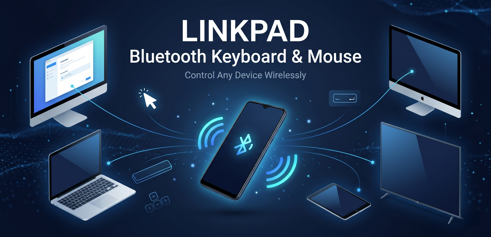

<p align="center">
  
</p>

<h1 align="center">Linkpad</h1>

<p align="center">
  <em>Turn your Android phone into a wireless keyboard, mouse, and media remote for any Bluetooth host. No companion app on the target device.</em>
</p>

<p align="center">
  <a href="https://play.google.com/store/apps/details?id=com.btremote.app"></a>
  <a href="https://www.android.com/"></a>
  <a href="https://developer.android.com/"></a>
  <a href="https://developer.android.com/"></a>
  <a href="https://kotlinlang.org/"></a>
  <a href="https://github.com/Devdas-gupta/linkpad/releases/latest"></a>
  <a href="#license"></a>
</p>

---

## Download

<p align="center">
  <a href="https://play.google.com/store/apps/details?id=com.btremote.app">
    
  </a>
</p>

Or grab the latest APK directly from [GitHub Releases](https://github.com/Devdas-gupta/linkpad/releases/latest).

---

## Overview

**Linkpad** is a Bluetooth HID controller built natively for Android. It pairs with any host that supports Classic Bluetooth — macOS, Windows, Linux, iPadOS, Android TV, and most smart TVs — and shows up as a generic combo keyboard + mouse. The host doesn't need any driver, helper app, or pairing code beyond the standard Bluetooth flow.

Use it as a silent remote for your living-room TV, a backup keyboard when yours dies mid-meeting, or a desk-side trackpad when you want your laptop closed.

---

## Features

- **Touchpad** — laptop-class trackpad with 1-finger move, 2-finger scroll (vertical + horizontal AC Pan), 2-finger tap right-click, tap-to-drag, and a precision right-edge scroll strip.
- **Software keyboard** — relays your typing to the host in real time. Optional Shortcuts row (Cmd / Ctrl + C/V/X/Z/A, Alt+Tab), F-keys, Edit cluster (Backspace / Del / Home / End / PgUp / PgDn / Insert), and Arrow cluster.
- **Air mouse** — gyroscope-driven cursor with drift-free Game Mode (sensor fusion) and a low-pass filter fallback. Works globally in the background across all screens (e.g., while typing on the keyboard). Features adjustable sensitivity, noise dead zone, non-linear acceleration curve, axis invert, and per-button visibility.
- **Media remote** — brightness, volume, mute, prev/next track, play/pause, plus press-and-hold FF/RW for continuous seeking.
- **TV Remote** — dedicated tab with D-Pad ring, system keys (Back / Home / Menu), volume & channel controls, colour function keys (F1–F4), Power & Input/Source buttons, and a numeric keypad.
- **Multi-host profiles** — save Mac / PC / iPad / TV profiles, each with its own target-OS layout and last-connected device. Switch in one tap.
- **Quick Settings Tile** — connect or reconnect directly from the Android notification shade.
- **Device Switcher Dropdown** — one-tap switch between paired hosts with Disconnect and Forget-device options.
- **Themed UI** — SoulExtender Synth glassmorphic dark theme with electric violet, neon cyan, and synth magenta accents. Light / dark / system toggle.

---

See [changelog.md](changelog.md) for the full detailed changelog.

---

## Screens

| Touchpad | Keyboard | Air Mouse |
| :-: | :-: | :-: |
| Trackpad surface + edge scroll strip | Live typing relay + chip rows | Gyro cursor visualizer + click row |

| Media | TV Remote | Connect | Settings |
| :-: | :-: | :-: | :-: |
| Brightness / volume / transport | D-Pad + numpad + system keys | Scan + paired history | Profiles, OS, theme, About |

---

## Build

### Android Studio (recommended)

1. **File → Open** and select the project root.
2. When prompted "Gradle Wrapper not found", choose **OK / Use Gradle from gradle-wrapper.properties**.
3. Studio downloads everything. Hit **Run**.

### Terminal

Make sure you have JDK 17+ installed, then build the debug APK using:

```sh
./gradlew assembleDebug
```

### Variants

| Command | Output |
| --- | --- |
| `./gradlew assembleDebug` | `app-debug.apk` (`com.btremote.app.debug` suffix) |
| `./gradlew assembleRelease` | R8-shrunk signed release APK |
| `./gradlew bundleRelease` | AAB for Play Store |
| `./gradlew lint` | Lint report |
| `./gradlew test` | Unit tests |

---

## Pair with a host

1. Open Linkpad → **Connect** tab → tap **Scan**.
2. Pick the device from the list (bonded devices appear first).
3. On the host, accept the pairing request (Linkpad shows up as a combo keyboard + mouse named **Linkpad**).
4. Done. Switch back to Touchpad / Keyboard / Media — anything you do is mirrored to the host instantly.

After the first pair, the active profile remembers the device. Tap **QUICK** on the connection bar next launch — no scan needed.

### Tested hosts

- macOS 12+
- Windows 10 / 11
- Linux (BlueZ 5.50+)
- iPadOS / iOS 14+
- Android TV / Google TV
- Most smart TVs (LG, Samsung) accept it as a BT keyboard

> **Not supported:** Android phones as the *host*. Stock and skinned Android (MIUI / One UI / ColorOS) filters out HID-Combo from another phone. Not fixable app-side.

---

## Tech stack

- **Kotlin** + **Jetpack Compose** (no XML layouts)
- **Hilt** dependency injection
- **DataStore Preferences** (split across app prefs / paired devices / host profiles)
- **BluetoothHidDevice** API for HID reports
- **MVVM** with one ViewModel per screen
- **Foreground Service** owns the HID profile proxy + device connection lifecycle
- Min SDK 28 · Target SDK 35

---

## Architecture

```
app/
├── bluetooth/         HID descriptor, report sender, service, scan manager, QS tile
├── data/              Preferences, paired-device cache, host profiles
├── sensor/            Gyroscope reader for air mouse
└── ui/
    ├── components/    Connection bar, glass card, mouse buttons, sliders, toggles
    ├── navigation/    Compose nav graph
    ├── screens/       Touchpad / Keyboard / AirMouse / Media / TV / Connect / Settings / Onboarding
    └── theme/         Material3 color, typography
```

The HID descriptor is a byte-exact combo (Boot Keyboard + 5-button mouse with AC Pan + Consumer control). Mouse polling runs at ~125 Hz to match commercial HID devices. Keyboard input uses 6-key rollover with mutex-guarded slot allocation.

---

## Privacy

Linkpad never connects to the internet. All Bluetooth traffic is local. Only data stored:

- A list of recently paired devices (name + MAC), kept on-device.
- Your settings (speeds, toggles, theme).
- Host profiles you create.

Nothing leaves your phone.

---

## Contributing

Issues and pull requests welcome. Before submitting:

1. Run `./gradlew lint` and `./gradlew test`.
2. Keep diffs focused — one feature or fix per PR.
3. If you touch the HID descriptor, **re-pair every test host** before retesting (hosts cache the descriptor at bond time).

---

## License

MIT — see [LICENSE](LICENSE).

---

## Author

**Devdas Kumar** · [@Devdas-gupta](https://github.com/Devdas-gupta)

If Linkpad saved you a Bluetooth dongle, a star on the repo is appreciated. ⭐
